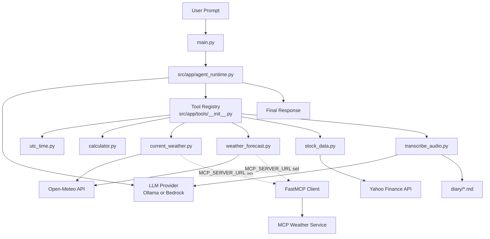

# Basic LangChain Agent (Ollama + AWS Bedrock)

This project provides a minimal Python agent built with LangChain.

## Features

- Select provider: `ollama` or `bedrock`
- Select model via `--model`
- Basic tools included:
  - `utc_time`
  - `calculator`
  - `current_weather` (current conditions by location)
  - `weather_forecast` (hourly forecast for next 24 hours)
  - `get_stock_data` (latest stock quote by ticker symbol)
  - `transcribe_audio` (transcribes a `.wav` file via the LLM and saves a Markdown diary entry)

## Architecture

Project layout:

```text
main.py
diary/                        ← audio transcripts saved here
src/
  app/
    agent_runtime.py
    tools/
      __init__.py
      utc_time.py
      calculator.py
      current_weather.py
      weather_forecast.py
      stock_data.py
      transcribe_audio.py
```

How it works:

- `main.py` is the application entrypoint and handles CLI args, env loading (`python-dotenv`), and interactive/single-shot execution.
- `src/app/agent_runtime.py` builds the selected LLM backend (`ollama` or `bedrock`), creates the LangChain agent, and normalizes model responses.
- `src/app/tools/` contains one tool per file; each tool is decorated with `@tool` and exposed through `src/app/tools/__init__.py` as `TOOLS`.
- Weather tools support two execution modes:
  - direct Open-Meteo HTTP calls (default)
  - FastMCP client routing when `MCP_SERVER_URL` is set.
- `Makefile` wraps common workflows (`setup`, `check`, `run`, provider-specific run targets, and `check-mcp`).

Architecture diagram:



  MCP weather call sequence:

  ```mermaid
  sequenceDiagram
    participant User
    participant Main as main.py
    participant Runtime as agent_runtime.py
    participant Tool as current_weather.py/weather_forecast.py
    participant FastMCP as FastMCP Client
    participant MCP as MCP Weather Service

    User->>Main: Ask weather question
    Main->>Runtime: invoke_agent(prompt)
    Runtime->>Tool: call selected weather tool
    Tool->>Tool: read MCP_SERVER_URL
    alt MCP_SERVER_URL is set
      Tool->>FastMCP: call_tool(name, {location})
      FastMCP->>MCP: MCP request
      MCP-->>FastMCP: tool result
      FastMCP-->>Tool: normalized response
    else MCP_SERVER_URL not set
      Tool->>Tool: fallback to Open-Meteo HTTP path
    end
    Tool-->>Runtime: weather result
    Runtime-->>Main: final answer text
    Main-->>User: Response
  ```

  Audio transcription call sequence:

  ```mermaid
  sequenceDiagram
    participant User
    participant Main as main.py
    participant Runtime as agent_runtime.py
    participant Tool as transcribe_audio.py
    participant LLM1 as openai-whisper (local)
    participant LLM2 as Ollama MARKDOWN_MODEL
    participant LLM as Bedrock LLM
    participant FS as diary/ (filesystem)

    User->>Main: "Transcribe recording.wav"
    Main->>Runtime: invoke_agent(prompt)
    Runtime->>Tool: transcribe_audio("recording.wav")
    Tool->>Tool: validate .wav file exists
    Tool->>Tool: read & base64-encode audio bytes
    Tool->>Tool: capture current datetime
    alt provider == ollama
      Tool->>LLM1: load_model(TRANSCRIPT_MODEL size) + transcribe wav
      LLM1-->>Tool: raw verbatim transcript
      Tool->>LLM2: HumanMessage ["Convert this transcript into clean Markdown"]
      LLM2-->>Tool: formatted Markdown body
    else provider == bedrock
      Tool->>LLM: HumanMessage [combined prompt + audio source block]
      LLM-->>Tool: formatted Markdown body
    end
    Tool->>Tool: build Markdown document (header: date, time + body)
    Tool->>FS: write diary/<yyyy-MM-ddTHHmmss>.md
    Tool-->>Runtime: "Transcript saved to: diary/..."
    Runtime-->>Main: final answer text
    Main-->>User: Response
  ```

Runtime flow:

1. `main.py` reads config from CLI/env.
2. `build_agent(...)` in `agent_runtime.py` creates model + tool-enabled agent.
3. User prompt is passed to the agent.
4. Agent calls tools from `TOOLS` when needed.
5. Final AI response is printed in single-shot or interactive mode.

## Setup

```bash
# Install system dependency required by openai-whisper
sudo apt-get install -y ffmpeg   # Debian/Ubuntu
# brew install ffmpeg            # macOS

python3 -m venv .venv
source .venv/bin/activate
pip install -r requirements.txt
cp .env.example .env
```

The app loads `.env` automatically (`python-dotenv`). CLI flags still override `.env` values.

## Run with Ollama (local network)

Set your Ollama endpoint/model in `.env` (or pass as CLI args):

```bash
export OLLAMA_BASE_URL="http://<ollama-host>:11434"
export PROVIDER="ollama"
export MODEL="llama3.1"
python main.py --prompt "What time is it in UTC?"
```

Interactive mode:

```bash
python main.py
```

## Run with AWS Bedrock

Ensure AWS credentials are configured (env vars, profile, or IAM role) and set region:

```bash
export AWS_REGION="us-east-1"
export PROVIDER="bedrock"
export MODEL="anthropic.claude-3-5-sonnet-20240620-v1:0"
python main.py --prompt "Calculate (24*7)-5"
```

Interactive mode:

```bash
python main.py
```

You can always override `.env` values from CLI, for example:

```bash
python main.py --provider ollama --model qwen2.5:7b --ollama-base-url http://192.168.1.50:11434
```

## Notes

- Bedrock model IDs vary by region/account access.
- Ollama model names depend on models pulled into your Ollama instance.
- Weather tools use Open-Meteo APIs (no API key required).
- Weather output is metric: `°C` and `m/s`.
- Stock data is fetched from Yahoo Finance (no API key required).
- `transcribe_audio` requires a multimodal LLM with native audio support (e.g. `anthropic.claude-3-5-sonnet-20240620-v1:0` on Bedrock). When using Ollama, local transcription is performed by `openai-whisper` (no API key needed).
- When using Ollama, `transcribe_audio` uses `openai-whisper` for step 1 (size controlled by `TRANSCRIPT_MODEL`) and an Ollama chat model for step 2 Markdown formatting (`MARKDOWN_MODEL`).

## Optional MCP weather backend (FastMCP client)

If you run weather capabilities as MCP tools, set:

```bash
export MCP_SERVER_URL="http://localhost:8000/mcp"
export MCP_WEATHER_CURRENT_TOOL="current_weather"
export MCP_WEATHER_FORECAST_TOOL="weather_forecast"
```

When `MCP_SERVER_URL` is set, the local weather tools call MCP services through FastMCP.
If it is not set, the agent uses direct Open-Meteo HTTP calls.

Quick MCP connectivity check:

```bash
MCP_SERVER_URL="http://localhost:8000/mcp" make check-mcp
```

## Weather tool prompts

Examples:

```bash
python main.py --prompt "What is the current weather in Berlin?"
python main.py --prompt "Give me the hourly weather forecast for the next 24 hours in Tokyo."
```

## Audio transcription tool

The `transcribe_audio` tool accepts a path to a `.wav` file, sends the audio to the LLM for
transcription, and saves the result as a Markdown file inside the `diary/` folder at the project
root.

**Output file location:** `diary/<yyyy-MM-ddTHHmmss>.md`

**Output file format:**

```markdown
# Transcript

**Date:** Tuesday, February 24, 2026  
**Time:** 14:30:00

---

<verbatim transcription text>
```

**Examples:**

```bash
python main.py --prompt "Transcribe the file /path/to/recording.wav"
python main.py --prompt "Please transcribe meeting.wav"
```

### Ollama — two-model pipeline

When `PROVIDER=ollama` the tool runs two sequential steps:

| Step | Env variable | Purpose |
|------|-------------|---------|
| 1 | `TRANSCRIPT_MODEL` | Whisper model **size** used by `openai-whisper` for local speech-to-text (`tiny`, `base`, `small`, `medium`, `large`, `large-v2`, `large-v3`) |
| 2 | `MARKDOWN_MODEL` | Ollama chat model that converts the raw transcript to clean Markdown |

If `TRANSCRIPT_MODEL` is not set, `base` is used as the default.  
If `MARKDOWN_MODEL` is not set, `MODEL` is used as the fallback.

> **Note:** `openai-whisper` downloads the selected model weights on first run
> and caches them in `~/.cache/whisper`.

Set them in `.env`:

```dotenv
TRANSCRIPT_MODEL=base
MARKDOWN_MODEL=qwen3:8b
### Bedrock — single-model call

On Bedrock, a single multimodal call produces the formatted Markdown directly (no extra variables needed).
