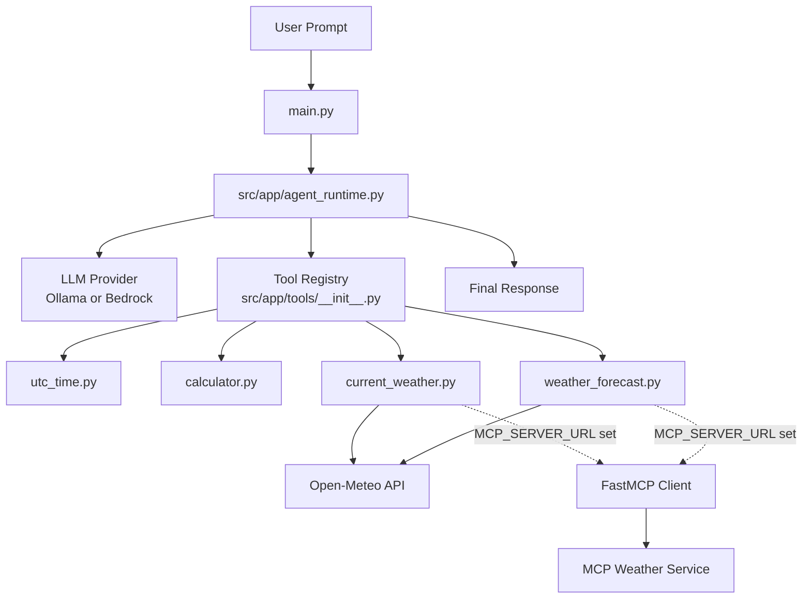

# Basic LangChain Agent (Ollama + AWS Bedrock)

This project provides a minimal Python agent built with LangChain.

## Features

- Select provider: `ollama` or `bedrock`
- Select model via `--model`
- Basic tools included:
  - `utc_time`
  - `calculator`
  - `current_weather` (current conditions by location)
  - `weather_forecast` (hourly forecast for next 24 hours)

## Architecture

Project layout:

```text
main.py
src/
  app/
    agent_runtime.py
    tools/
      __init__.py
      utc_time.py
      calculator.py
      current_weather.py
      weather_forecast.py
```

How it works:

- `main.py` is the application entrypoint and handles CLI args, env loading (`python-dotenv`), and interactive/single-shot execution.
- `src/app/agent_runtime.py` builds the selected LLM backend (`ollama` or `bedrock`), creates the LangChain agent, and normalizes model responses.
- `src/app/tools/` contains one tool per file; each tool is decorated with `@tool` and exposed through `src/app/tools/__init__.py` as `TOOLS`.
- Weather tools support two execution modes:
  - direct Open-Meteo HTTP calls (default)
  - FastMCP client routing when `MCP_SERVER_URL` is set.
- `Makefile` wraps common workflows (`setup`, `check`, `run`, provider-specific run targets, and `check-mcp`).

Architecture diagram:



  MCP weather call sequence:

  ```mermaid
  sequenceDiagram
    participant User
    participant Main as main.py
    participant Runtime as agent_runtime.py
    participant Tool as current_weather.py/weather_forecast.py
    participant FastMCP as FastMCP Client
    participant MCP as MCP Weather Service

    User->>Main: Ask weather question
    Main->>Runtime: invoke_agent(prompt)
    Runtime->>Tool: call selected weather tool
    Tool->>Tool: read MCP_SERVER_URL
    alt MCP_SERVER_URL is set
      Tool->>FastMCP: call_tool(name, {location})
      FastMCP->>MCP: MCP request
      MCP-->>FastMCP: tool result
      FastMCP-->>Tool: normalized response
    else MCP_SERVER_URL not set
      Tool->>Tool: fallback to Open-Meteo HTTP path
    end
    Tool-->>Runtime: weather result
    Runtime-->>Main: final answer text
    Main-->>User: Response
  ```

Runtime flow:

1. `main.py` reads config from CLI/env.
2. `build_agent(...)` in `agent_runtime.py` creates model + tool-enabled agent.
3. User prompt is passed to the agent.
4. Agent calls tools from `TOOLS` when needed.
5. Final AI response is printed in single-shot or interactive mode.

## Setup

```bash
python3 -m venv .venv
source .venv/bin/activate
pip install -r requirements.txt
cp .env.example .env
```

The app loads `.env` automatically (`python-dotenv`). CLI flags still override `.env` values.

## Run with Ollama (local network)

Set your Ollama endpoint/model in `.env` (or pass as CLI args):

```bash
export OLLAMA_BASE_URL="http://<ollama-host>:11434"
export PROVIDER="ollama"
export MODEL="llama3.1"
python main.py --prompt "What time is it in UTC?"
```

Interactive mode:

```bash
python main.py
```

## Run with AWS Bedrock

Ensure AWS credentials are configured (env vars, profile, or IAM role) and set region:

```bash
export AWS_REGION="us-east-1"
export PROVIDER="bedrock"
export MODEL="anthropic.claude-3-5-sonnet-20240620-v1:0"
python main.py --prompt "Calculate (24*7)-5"
```

Interactive mode:

```bash
python main.py
```

You can always override `.env` values from CLI, for example:

```bash
python main.py --provider ollama --model qwen2.5:7b --ollama-base-url http://192.168.1.50:11434
```

## Notes

- Bedrock model IDs vary by region/account access.
- Ollama model names depend on models pulled into your Ollama instance.
- Weather tools use Open-Meteo APIs (no API key required).
- Weather output is metric: `°C` and `m/s`.

## Optional MCP weather backend (FastMCP client)

If you run weather capabilities as MCP tools, set:

```bash
export MCP_SERVER_URL="http://localhost:8000/mcp"
export MCP_WEATHER_CURRENT_TOOL="current_weather"
export MCP_WEATHER_FORECAST_TOOL="weather_forecast"
```

When `MCP_SERVER_URL` is set, the local weather tools call MCP services through FastMCP.
If it is not set, the agent uses direct Open-Meteo HTTP calls.

Quick MCP connectivity check:

```bash
MCP_SERVER_URL="http://localhost:8000/mcp" make check-mcp
```

## Weather tool prompts

Examples:

```bash
python main.py --prompt "What is the current weather in Berlin?"
python main.py --prompt "Give me the hourly weather forecast for the next 24 hours in Tokyo."
```
